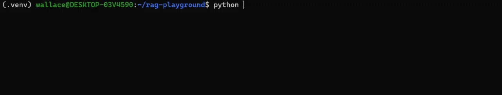
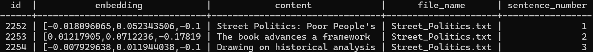

# RAG Playground

A learning project for building a Retrieval-Augmented Generation (RAG) pipeline Ollama

<p align="center">
  
</p>


---


## Requirement

For Windows machine:

- **WSL** with Ubuntu
- **Docker Desktop** with WSL integration enabled 

## Installation

### Terminal A — Set up Ollama and keep it running

```bash
curl -fsSL https://ollama.com/install.sh | sh

ollama pull qwen3:0.6b
ollama pull nomic-embed-text
ollama create custom_qwen -f ModelFile

# listen on every network interface so Docker can reach Ollama
OLLAMA_HOST=0.0.0.0 ollama serve
```

To verify the models are loaded:
```bash
ollama run custom_qwen
```

### Terminal B — Clone and set up the project

```bash
git clone https://github.com/aliabbasi2000/rag-playground.git
cd rag-playground

python -m venv .venv
source .venv/bin/activate

pip install -r requirements.txt
```

### Environment Variables

Before running the project, copy the example environment file and update it with your credentials:

```bash
cp .env.example .env
```

---

## Running the Project

### Option 1 — Run locally

```bash
source .venv/bin/activate 
sudo systemctl start postgresql     # database must be running
python src/generate_corpus.py      # wait for the program to finish 
# check downloaded articles in data/all_articles
python src/populate_vector_db.py    # wait for the program to finish 
# check the database for the inserted vector embeddings
python main.py                     # chat with the local RAG
```

### Option 2 — Run inside Docker

For the first run, build the container and let it download the articles and generate the vector embeddings:
```bash
docker compose up --build
```

After the first run, start local RAG without initial setups
```bash
docker compose run --rm rag python main.py
```

---

## Databases
 
### Schema



*Note: This project has two PostgreSQL instances. Only one should run at a time.*

### Option A — Docker PostgreSQL (recommended)
 
Runs as a container. Starts automatically and No manual installation needed.
 
```bash
# Start (detached)
docker compose up db -d
 
# Connect
psql -h localhost -U postgres -d text_embeddings

# Stop
docker compose stop db
```
 
> ⚠️ If Docker PostgreSQL fails to start with "port already in use", the local PostgreSQL is running. Stop it first: `sudo systemctl stop postgresql`
 
### Option B — Local WSL PostgreSQL
 
Installed directly on Ubuntu. Used for development without Docker.
 
```bash
# Start
sudo systemctl start postgresql
 
# Connect
psql -U postgres -d text_embeddings
 
# Stop
sudo systemctl stop postgresql
```
 
> ⚠️ If PostgreSQL fails to start with "port already in use", the Docker PostgreSQL is running. Stop it first with: `docker compose stop db`

---

## Development Loop

```
1. Edit your .py files locally
         ↓
2. Test quickly with local Python
   python main.py
         ↓
3. When it works, run in Docker
   docker compose up --build
```