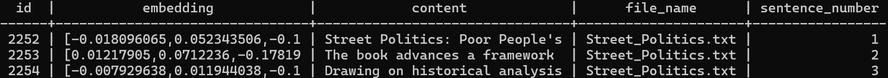
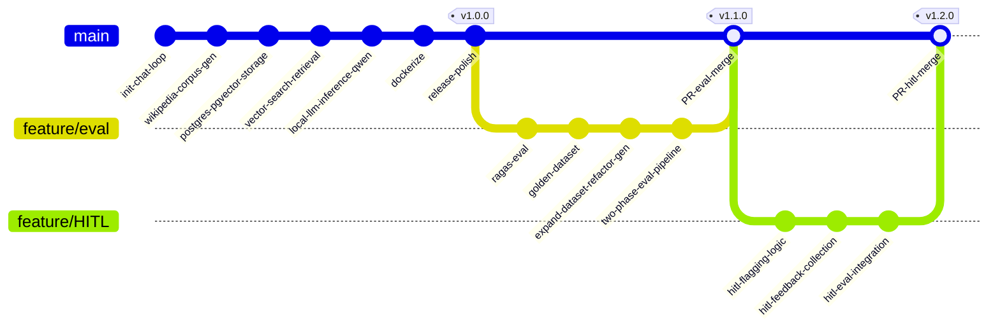

# Political RAG

A Retrieval-Augmented Generation (RAG) system built from scratch, focusing on politics. 

This system generates a corpus from Wikipedia articles on political topics, stores sentence embeddings in PostgreSQL with pgvector, and uses prompt engineering to answer questions using a local LLM running on your machine with no external API calls. Answers quality is assessed with RAGAS evaluation method, and a human-in-the-loop (HITL) review step for a subject matter expert to check the low accuracy responses.


<p align="center">
  
  <br/>
  <em>Querying the RAG pipeline with political questions</em>
</p>


---


## Requirement

For Windows machine:

- **WSL** with Ubuntu
- **Docker Desktop** with WSL integration enabled 

## Installation

### Terminal A — Set up Ollama and keep it running

```bash
curl -fsSL https://ollama.com/install.sh | sh

ollama pull qwen3:0.6b
ollama pull nomic-embed-text
ollama create custom_qwen -f ModelFile

# listen on every network interface so Docker can reach Ollama
OLLAMA_HOST=0.0.0.0 ollama serve
```

To verify the models are loaded:
```bash
ollama run custom_qwen
```

### Terminal B — Clone and set up the project

```bash
git clone https://github.com/aliabbasi2000/rag-playground.git
cd rag-playground

python -m venv .venv
source .venv/bin/activate

pip install -r requirements.txt

python -c "import nltk; nltk.download('punkt')"
```

### Environment Variables

Before running the project, copy the example environment file and update it with your credentials:

```bash
cp .env.example .env
```

## Running the Project

### Option 1 — Run locally

```bash
source .venv/bin/activate 
sudo systemctl start postgresql     # database must be running
python src/generate_corpus.py      # wait for the program to finish 
# check downloaded articles in data/all_articles
python src/populate_vector_db.py    # wait for the program to finish 
# check the database for the inserted vector embeddings
python main.py                     # chat with the local RAG
```

### Option 2 — Run inside Docker

For the first run, build the container and let it download the articles and generate the vector embeddings:
```bash
docker compose up --build
```

After the first run, start local RAG without initial setups
```bash
docker compose run --rm rag python main.py
```

## Architecture Evaluation

To Evaluate the proposed RAG, execute the evaluation phase like below:
```bash
python run_eval.py
```
The Evaluations below are done over 25 golden samples using a local LLM as a judge. 

### Evaluation 1

* **Generator Model:** `qwen3:0.6b` (Generates answers from the retrieved context)
* **Judge Model:** `qwen3:1.7b` (Evaluates the generated answers)

### Results

| Metric | Score |
|---|---|
| **Faithfulness** | 0.63 |
| **Answer Relevancy** | 0.14 |
| **Context Precision** | 0.95 |
| **Context Recall** | 1.0 |

> Note: These results indicate a well-performing retrieval phase (high Context Precision and Recall) but an underperforming generation phase (low Faithfulness and Answer Relevancy). To address this, the evaluation was repeated using larger models for both the generator and the judge. The updated results are below:

### Evaluation 2 

* **Generator Model:** `qwen3:1.7b` (Generates answers from the retrieved context)
* **Judge Model:** `qwen3:4b` (Evaluates the generated answers)

### Results

| Metric | Score |
|---|---|
| **Faithfulness** | 0.98 |
| **Answer Relevancy** | 0.91 |
| **Context Precision** | 0.98 |
| **Context Recall** | 1.0 |

> Note: Using a larger model improved the performance of generation phase.

## Human-in-the-Loop (HITL) Evaluation
 
A subject matter expert (SME) can optionally review the answers RAGAS scored the lowest. When enabled, it runs as **Pass 3** of `run_eval.py`, right after the automated RAGAS scoring in Pass 2.
 
**Enabling it**
 
 HITL is off by default. Turn it when an SME is available to review in this:
 
```bash
# in .env
HITL_ENABLED=true
HITL_FLAG_THRESHOLD=0.7
HITL_REVIEWER_NAME=ReviewerName
```
 
```bash
python run_eval.py
```

**How it works**
- Any answer where a RAGAS metric falls below `HITL_FLAG_THRESHOLD` will be get flagged.
- For each flagged answer, the reviewer will see the model's response for a query, and the metrics that triggered the flag. Then he will be asked to provide the feedback records of **Approve**, **Reject**, or **Skip**, plus an optional comment.
- Finally, the Feedback will be saved to `eval/theEvalExperiment/hitl_feedback.json`


## Databases
 
### Schema



*Note: This project has two PostgreSQL instances. Only one should run at a time.*

### Option A — Docker PostgreSQL (recommended)
 
Runs as a container. Starts automatically and No manual installation needed.
 
```bash
# Start (detached)
docker compose up db -d
 
# Connect
psql -h localhost -U postgres -d text_embeddings

# Stop
docker compose stop db
```
 
> Note: If Docker PostgreSQL fails to start with "port already in use", the local PostgreSQL is running. Stop it first: `sudo systemctl stop postgresql`
 
### Option B — Local WSL PostgreSQL
 
Installed directly on Ubuntu. Used for development without Docker.
 
```bash
# Start
sudo systemctl start postgresql
 
# Connect
psql -U postgres -d text_embeddings
 
# Stop
sudo systemctl stop postgresql
```
 
> Note: If PostgreSQL fails to start with "port already in use", the Docker PostgreSQL is running. Stop it first with: `docker compose stop db`


## Development Loop

```
1. Edit your .py files locally
         ↓
2. Test quickly with local Python
   python main.py
         ↓
3. When it works, run in Docker
   docker compose up --build
```

## Repository Structure

```text
political-rag/
├── assets/                       # Static images and diagrams
├── data/
│   └── all_articles/             # Raw article corpus for RAG indexing pulled by generate_corpus.py script
├── eval/                         
│   ├── samples/                       # 5 sample articles used for local eval runs
│   ├── gen_qwen0.6b_judge_qwen1.7b/   # Evaluation experiment 1
│   ├── gen_qwen1.7b_judge_qwen4b/     # Evaluation experiment 2
│   └── golden_dataset.json       
├── src/
│   ├── embedding_db.py           # Defines embedding table model
│   ├── generate_corpus.py        # Downloads and saves raw Wikipedia political articles
│   ├── populate_vector_db.py     # Splits articles, embeds sentences, inserts into PostgreSQL
│   ├── prepare_content.py        # Retrieves and formats context blocks for prompt input
│   ├── retrieve_db_content.py    # Runs vector similarity search and context window retrieval
|   ├── hitl_review.py            # HITL flagging + feedback collection
│   └── run_prompt.py             # Sends prompts to the local LLM
├── .env.example                  # Example environment variables
├── .env                          # Local environment config (not committed)
├── Dockerfile                    # Container definition for the app
├── docker-compose.yml            # Service orchestration for app + database
├── init.sql                      # PostgreSQL initialization script
├── main.py                       # Main chat entry point
├── ModelFile                     # Ollama model definition for the generator
├── Modelfile.judge               # Ollama model definition for the judge
├── requirements.txt              # Python dependencies
├── run_eval.py                   # Evaluation script
└── .venv/                        # Local Python virtual environment
```

## Summary of Repository History


```mermaid
gitGraph
   commit id: "init-chat-loop"
   commit id: "wikipedia-corpus-gen"
   commit id: "postgres-pgvector-storage"
   commit id: "vector-search-retrieval"
   commit id: "local-llm-inference-qwen"
   commit id: "dockerize"
   commit id: "release-polish" tag: "v1.0.0"
   branch feature/eval
   checkout feature/eval
   commit id: "ragas-eval"
   commit id: "golden-dataset"
   commit id: "expand-dataset-refactor-gen"
   commit id: "two-phase-eval-pipeline"
   checkout main
   merge feature/eval id: "PR-eval-merge" tag: "v1.1.0"
   branch feature/HITL
   checkout feature/HITL
   commit id: "hitl-flagging-logic"
   commit id: "hitl-feedback-collection"
   commit id: "hitl-eval-integration"
   checkout main
   merge feature/HITL id: "PR-hitl-merge" tag: "v1.2.0"
```